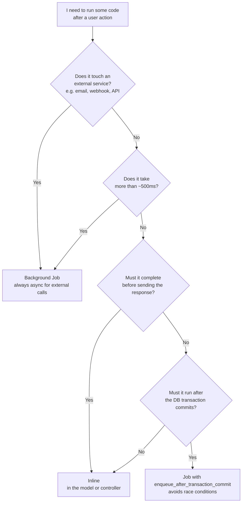
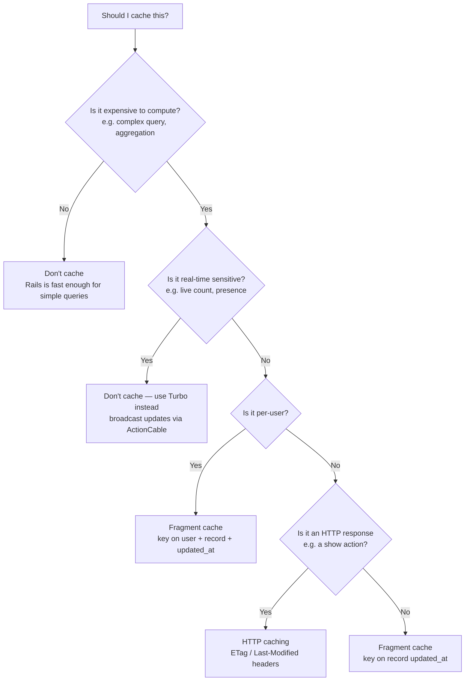
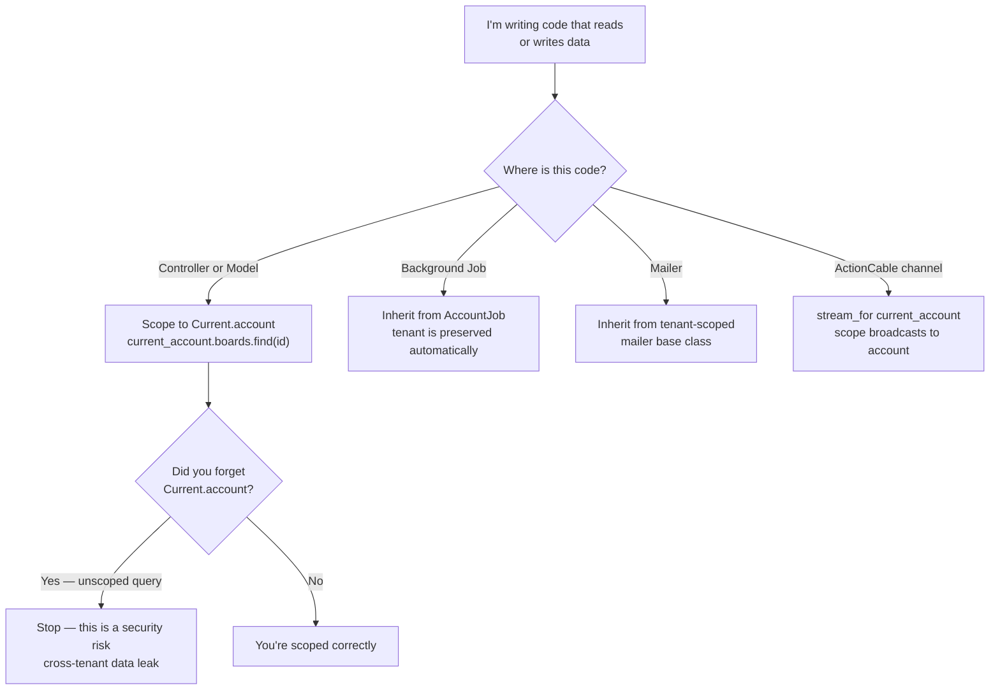
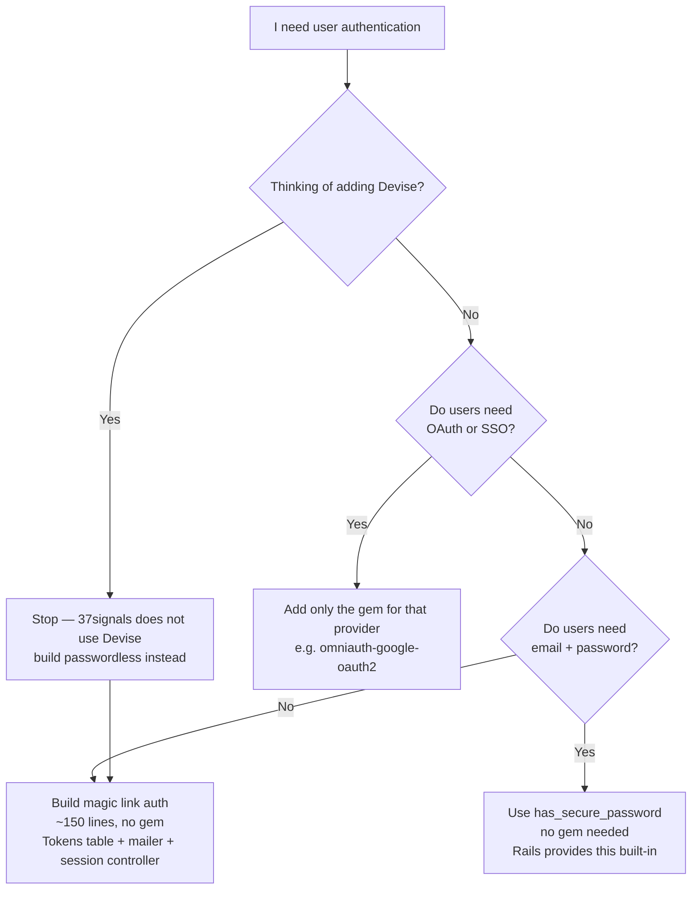

# Backend Decision Guide

Flowcharts for background jobs, caching, multi-tenancy scoping, and authentication.

---

## Should this run inline or as a background job?

> Use this when writing code that might be slow or touch external services.

**Why?** Background jobs keep response times fast and make failures retryable. `enqueue_after_transaction_commit` is critical — enqueueing inside a transaction can cause the job to run before the data it needs is actually committed.

→ See [`background-jobs.md`](../background-jobs.md)

---

## Should I cache this?

> Use this before adding any caching layer.

**Why?** Over-caching creates stale data bugs. Start with no cache, measure, and add caching only where profiling shows a real bottleneck. For real-time data, Turbo broadcasts are a better answer than short TTLs.

→ See [`caching.md`](../caching.md) and [`performance.md`](../performance.md)

---

## How should I scope this for multi-tenancy?

> Use this every time you write a query or send data on behalf of a user.

**Why?** Every database query must be scoped to the current account. An unscoped `Board.find(id)` can return data from another tenant. 37signals uses path-based tenancy with `Current.account` as the ubiquitous scope.

→ See [`multi-tenancy.md`](../multi-tenancy.md) and [`background-jobs.md`](../background-jobs.md)

---

## Authentication: gem or custom?

> Use this when starting a new Rails app or adding authentication to an existing one.

**Why?** Devise solves problems most apps don't have and obscures Rails conventions behind DSLs. A passwordless magic link implementation is ~150 lines of plain Rails — readable, debuggable, and ownable.

→ See [`authentication.md`](../authentication.md)
