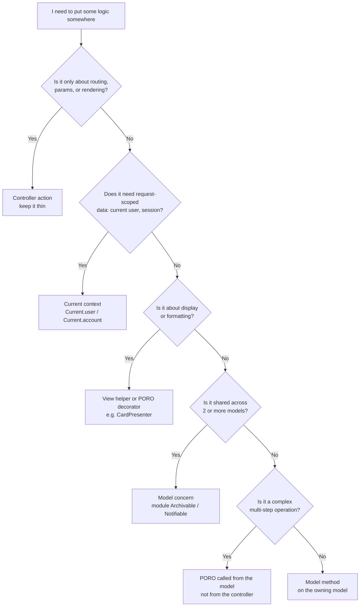
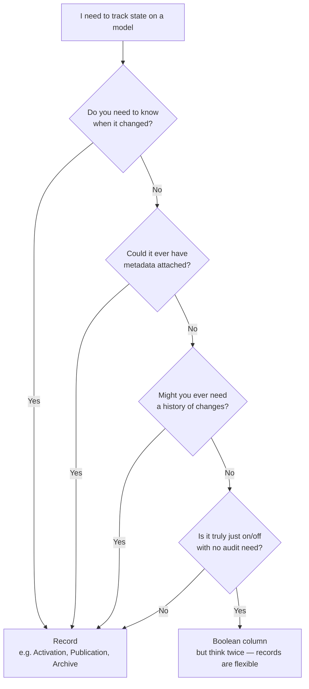
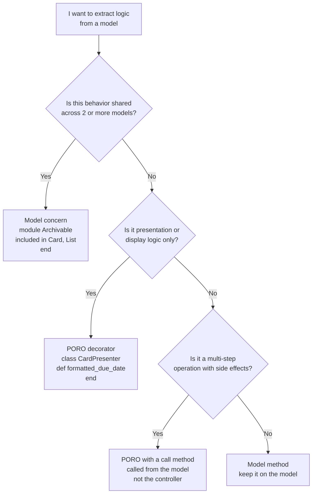
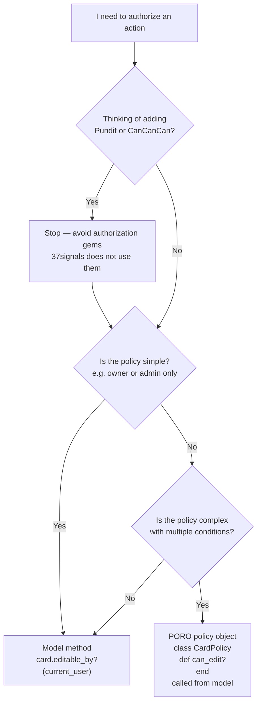

# Core Rails Decision Guide

Flowcharts for the most common architecture decisions in Rails models, controllers, and views.

---

## Where should this logic live?

> Use this when you've written code in a controller action and it feels like it doesn't belong there.

**Why?** Controllers should only route, authorize, and render — all domain logic belongs in the model layer. Moving logic down makes it testable in isolation and reusable without a request context.

→ See [`controllers.md`](../controllers.md) and [`models.md`](../models.md)

---

## Should this be a boolean column or a record?

> Use this when you're designing a feature that tracks whether something is active, archived, published, etc.

**Why?** Boolean columns lose history and can't hold metadata. A `Publication` record knows *when* something was published and *by whom*. 37signals defaults to records because requirements always expand.

→ See [`models.md`](../models.md) and [`database.md`](../database.md)

---

## Should I use a model concern or a PORO?

> Use this when a model is getting large and you want to extract logic.

**Why?** Concerns handle horizontal sharing; POROs handle complex vertical operations. Putting complex logic in a PORO and calling it *from the model* keeps controllers thin while avoiding the god-object problem.

→ See [`models.md`](../models.md)

---

## How should I authorize this action?

> Use this when you need to check whether a user can perform an operation.

**Why?** Authorization logic lives closest to the data it protects — the model. Gems like Pundit add indirection without adding value. A simple `can_edit?(user)` method is readable, testable, and sufficient.

→ See [`controllers.md`](../controllers.md)
