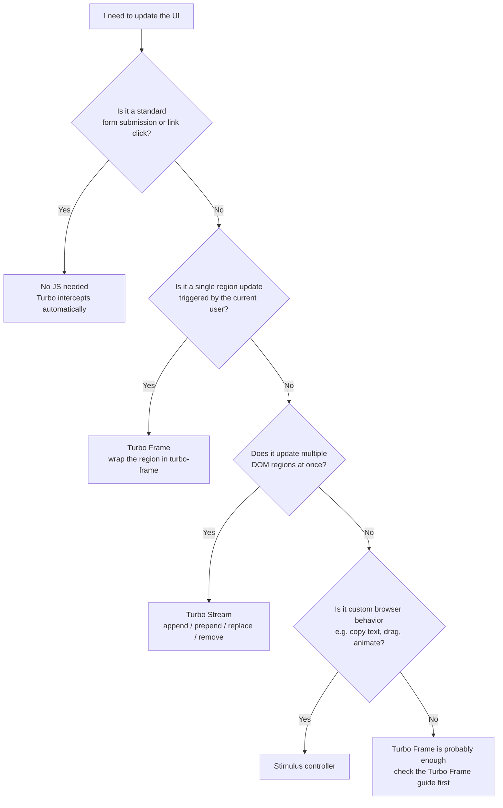
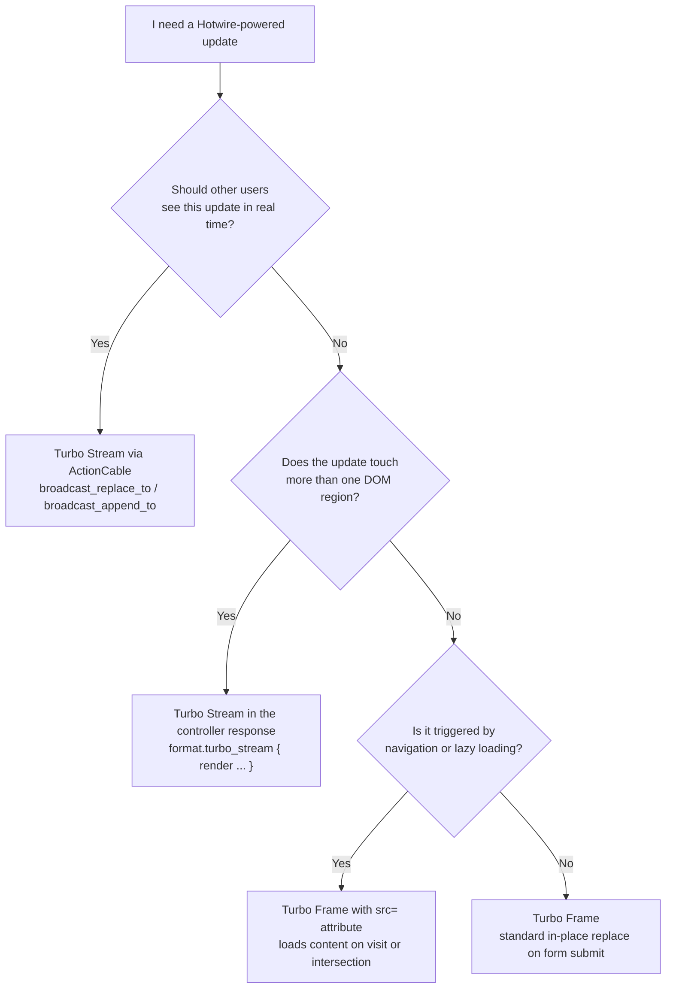
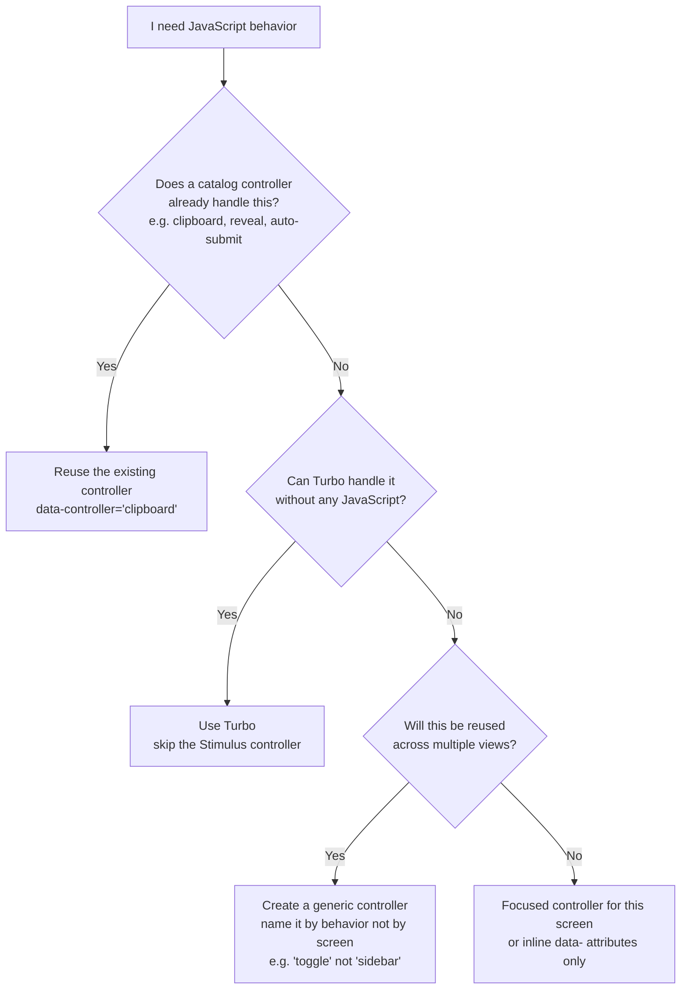
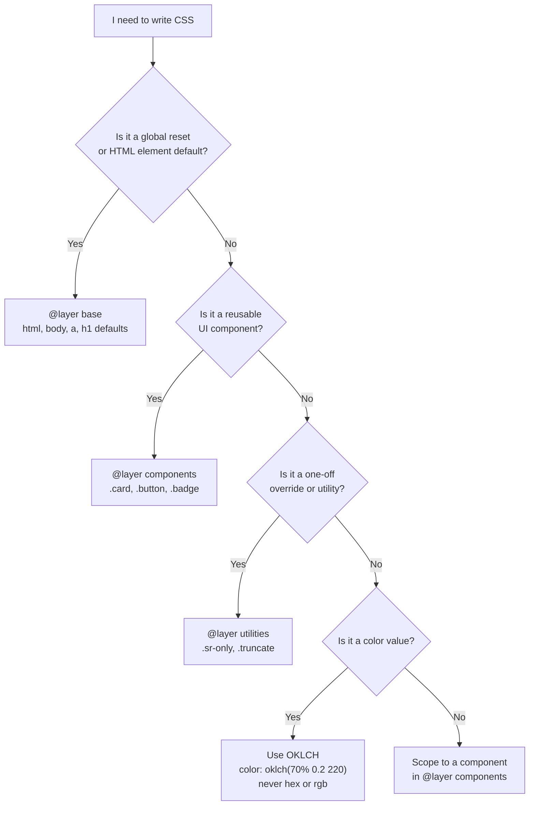

# Frontend Decision Guide

Flowcharts for choosing between Turbo primitives, Stimulus, and CSS patterns.

---

## Does this UI update need JavaScript at all?

> Use this before writing any frontend code. Turbo handles more than you think.

**Why?** Turbo eliminates the need for JavaScript in the vast majority of UI interactions. Reach for Stimulus only when Turbo genuinely cannot do it.

→ See [`hotwire.md`](../hotwire.md)

---

## Turbo Frame or Turbo Stream?

> Use this once you've determined you need a Hotwire update.

**Why?** Frames scope updates to one region and are driven by user action. Streams can target multiple regions and can be broadcast server-side. When in doubt, start with a Frame — upgrade to Stream if you need multi-target or broadcast.

→ See [`hotwire.md`](../hotwire.md) and [`actioncable.md`](../actioncable.md)

---

## Should I create a new Stimulus controller?

> Use this when you think you need to write JavaScript for a UI behavior.

**Why?** The Stimulus catalog in `stimulus.md` has many reusable controllers ready to drop in. New controllers should be named by their generic behavior — `toggle`, `clipboard`, `countdown` — so they can be reused without modification.

→ See [`stimulus.md`](../stimulus.md)

---

## Which CSS layer should I write this in?

> Use this when adding new styles. 37signals uses native CSS cascade layers instead of preprocessors or utility frameworks.

**Why?** Cascade layers make specificity explicit and predictable. `@layer utilities` always wins over `@layer components`, which always wins over `@layer base` — no specificity hacks needed. OKLCH gives perceptually uniform color manipulation.

→ See [`css.md`](../css.md)
