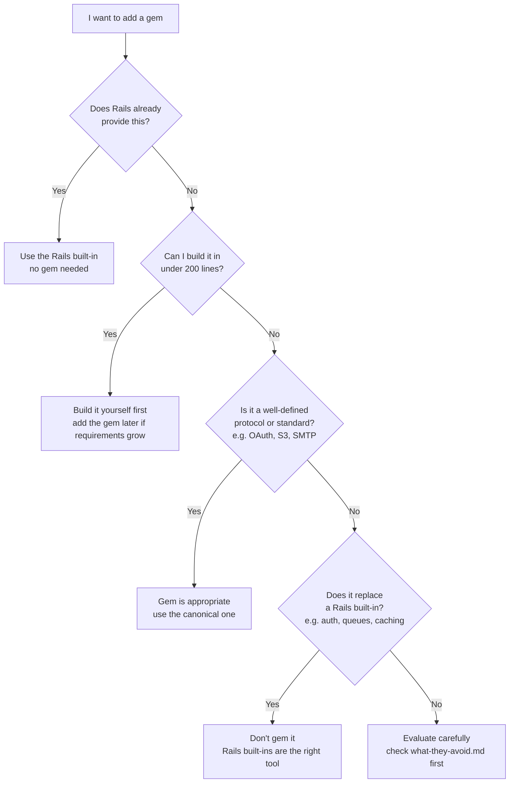
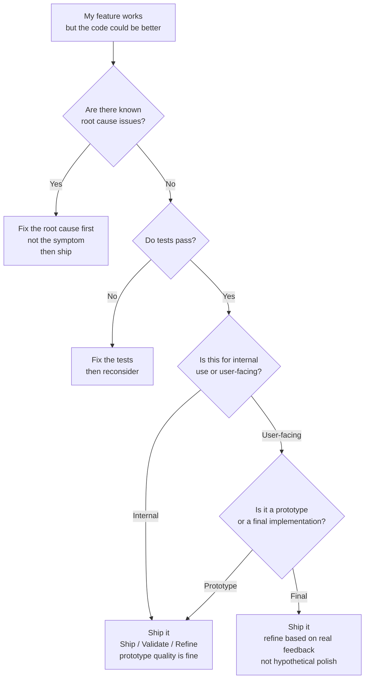
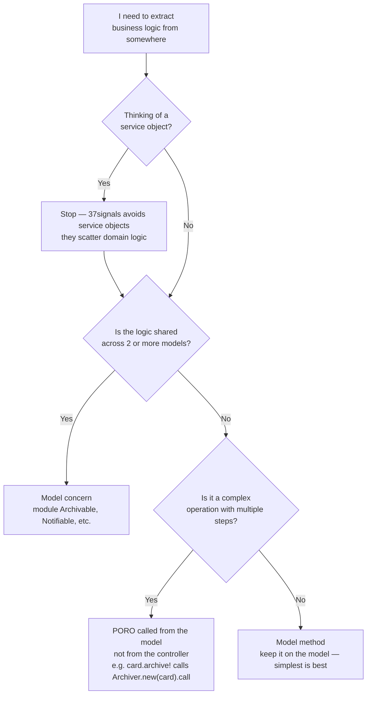
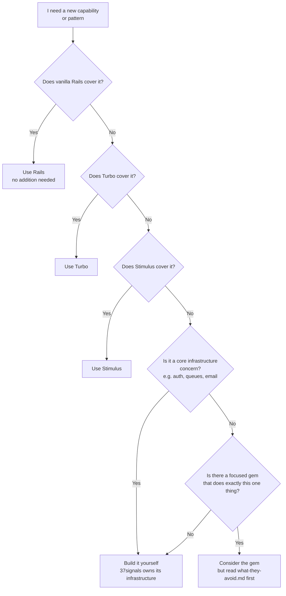

# Philosophy Decision Guide

Flowcharts for the meta-decisions: when to add gems, when to ship, how to structure code, and when to build vs. depend.

---

## Should I add this gem?

> Use this before running `bundle add` on anything.

**Why?** Every gem is a dependency you must maintain, upgrade, and debug through. 37signals has built authentication (~150 lines), background jobs (Solid Queue), and caching systems from scratch because owning the code means understanding it.

→ See [`what-they-avoid.md`](../what-they-avoid.md) and [`development-philosophy.md`](../development-philosophy.md)

---

## Should I ship this now or keep polishing?

> Use this when you have working code but you're unsure if it's ready.

**Why?** The Ship/Validate/Refine cycle is 37signals' core rhythm. Shipping prototype-quality code internally is encouraged — you learn more from real use than from polishing in isolation. Root cause fixes are the only non-negotiable before shipping.

→ See [`development-philosophy.md`](../development-philosophy.md)

---

## Service object or something else?

> Use this when you're tempted to create a `app/services/` directory.

**Why?** Service objects push domain logic out of models into disconnected classes, making it harder to find and test. A PORO called *from* the model keeps the model as the public API while still isolating complex logic.

→ See [`models.md`](../models.md) and [`development-philosophy.md`](../development-philosophy.md)

---

## Should I add a new pattern or dependency?

> Use this when you're considering introducing something the codebase doesn't already use.

**Why?** The hierarchy is: Rails → Turbo → Stimulus → build it → gem it. Working up the stack in that order keeps the codebase lean and ensures you understand each layer before adding the next.

→ See [`what-they-avoid.md`](../what-they-avoid.md)
